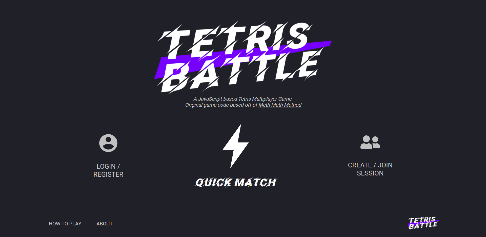
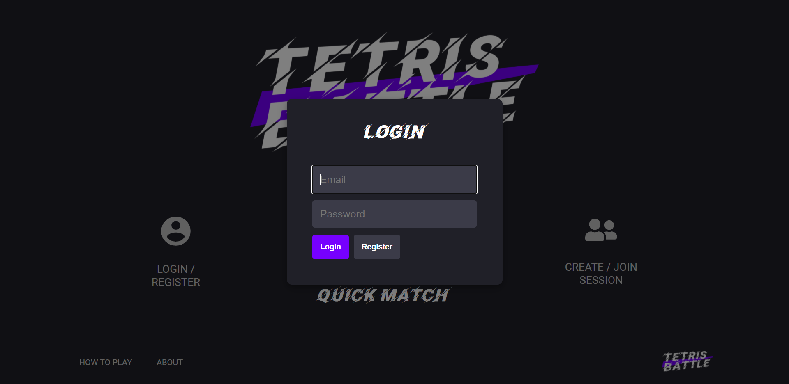
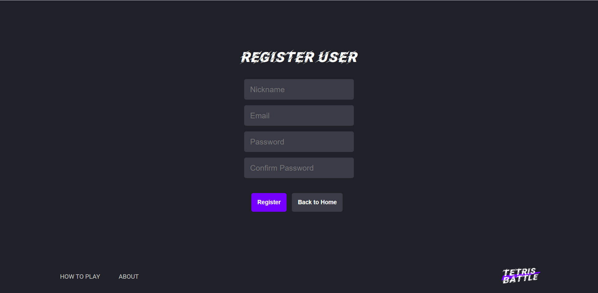
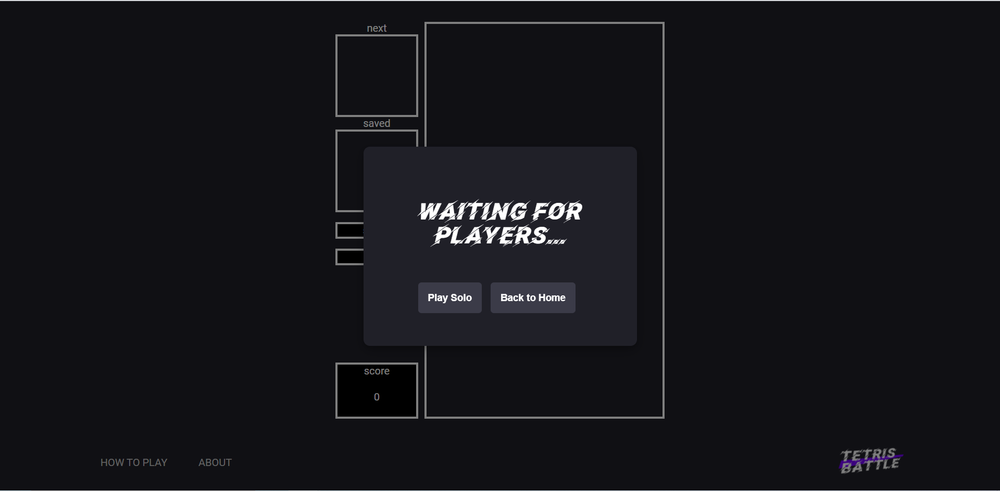
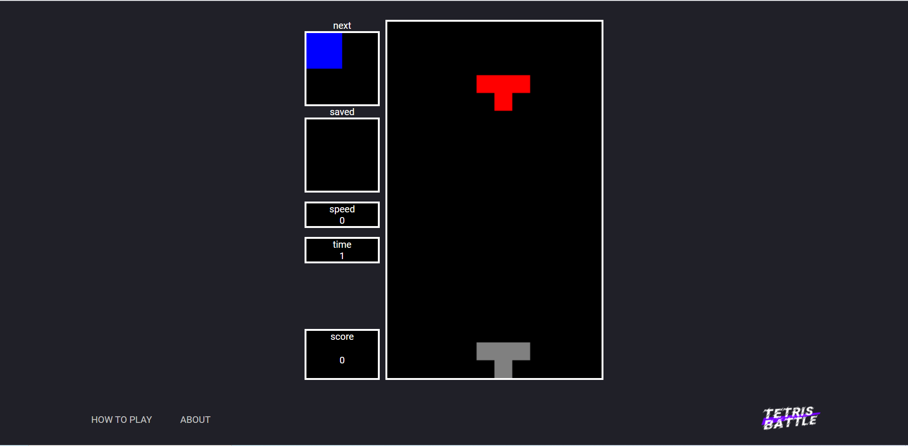
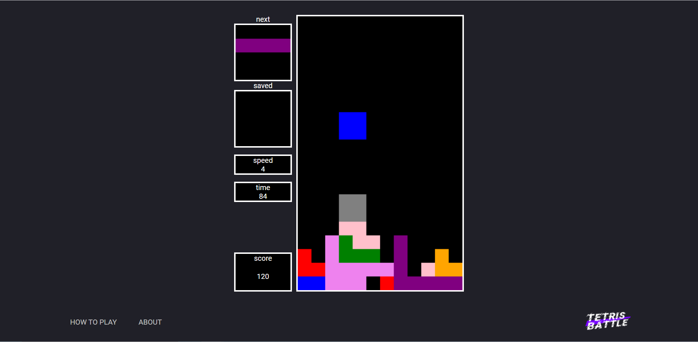
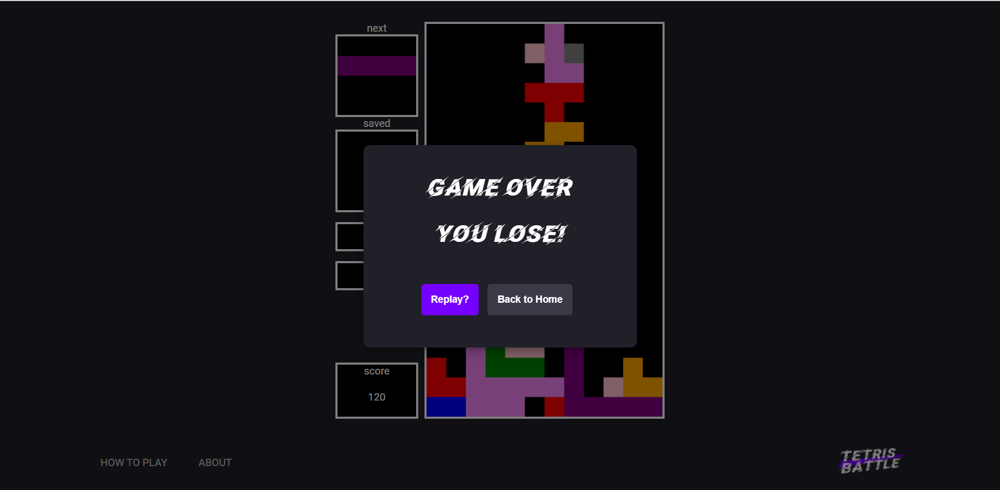

# Tetris Battle!

---

## 프로젝트 설명

**실시간으로** 임의의 사용자들과 1:1 대결이 가능한 테트리스 게임입니다.  
싱글 플레이 모드, 멀티 플레이 모드가 있으며,  
사용자가 방을 만들어 여러 친구들을 초대해 게임을 즐길 수 있습니다.

---

## 개발 기능

### 테트리스 게임

1. 블록 저장 기능
2. 다음 블록 표시 기능
3. 블록 낙하 위치 표시
4. 타임/스피드 기능 등을 추가(시간이 지날 수록 블록 낙하 속도가 점점 빨라짐)

### 이외 기능들

- Websocket + Express
- 싱글 플레이/멀티 플레이 선택
- 게임 재대결 여부 선택
- 인게임 채팅
- 커스텀 세션 추가/조인 기능
- 홈페이지 로그인/회원가입

---

## 게임 실행

[게임 메인 화면]

[로그인 화면]

[계정 등록 화면]

[대결 상대 접속을 기다리는 화면]

[솔로 플레이 화면]

[솔로 플레이 화면]

[솔로 플레이 도중 game end 화면]

이미지 넣기.  
게임 메인 화면  
게임 실행 상황- 싱글, 멀티 선택  
게임에서 이긴 후, 혹은 진 후 보이는 화면

---

## 사용 기술 스택

- Javascript
- websocket + express
- AWS RDS, EC2

---

## 개발자

이호민  
이대곤   
심규철
